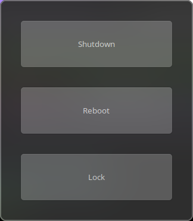

# Power Menu
This is my powermenu made in Rust with Gtk.

### Preview
This is a preview using WhiteSur gtk theme

### Dependencies
- [gtk](https://crates.io/crates/gtk) -  Rust bindings for the GTK+ 3 library 
### Requirements
- [dm-tool](https://aur.archlinux.org/packages/dmtool) - Required for locking user session